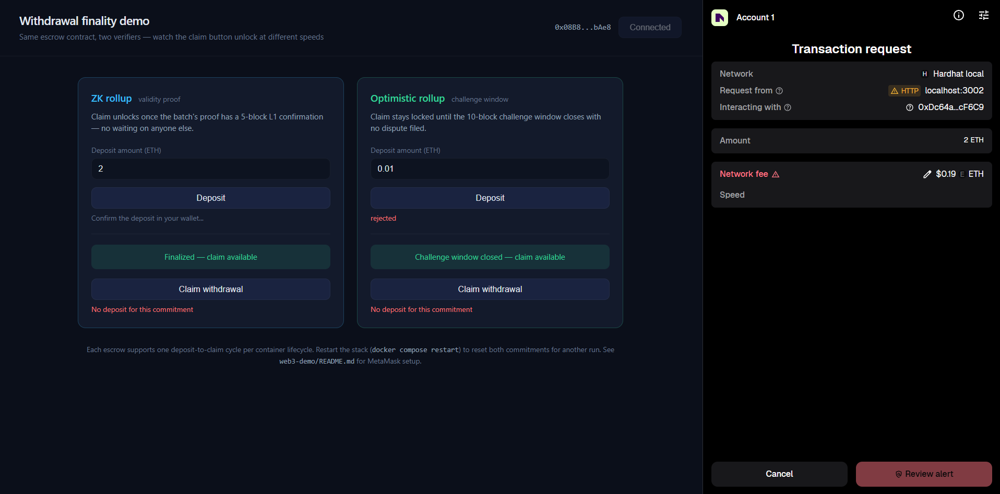
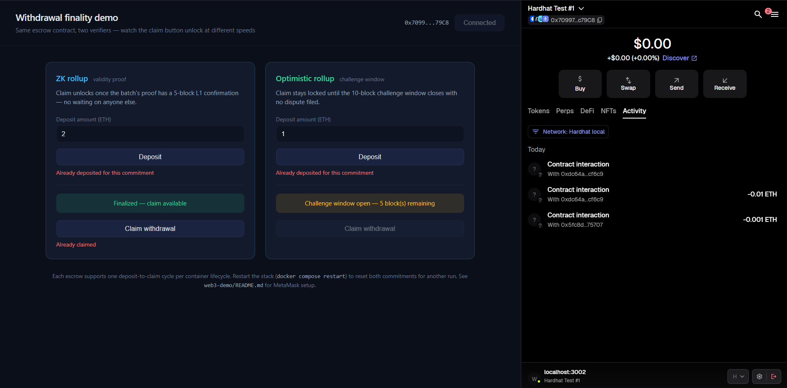

# Withdrawal finality demo

A small wallet-connected page that makes the finality gap between the two
rollups tangible: deposit ETH tied to a batch commitment, then watch how long
each architecture makes you wait before the claim button unlocks.

This is the only part of the repo that talks to a real browser wallet.
Everything else in the project (Flask dashboard, sequencers) runs server-side
with no wallet involved.



## What it demonstrates

Both `ZKVerifier` and `OptimisticVerifier` expose an `isFinalized(id)` check.
`WithdrawalEscrow.claim()` calls that same check before releasing funds — so
the *only* difference between the ZK and Optimistic panels on this page is
how fast `isFinalized()` turns true:

- **ZK escrow**: unlocks once the batch has a 5-block L1 confirmation (a few seconds on Hardhat).
- **Optimistic escrow**: stays locked for the full 10-block challenge window (~2 minutes on Hardhat), and stays locked indefinitely if the commitment gets challenged.

It is a toy round-trip (you get back exactly what you deposited), not a real
bridge — the point is the gating mechanism, not moving real value.

## Setup

1. Start the stack: `docker compose up --build`. This deploys `WithdrawalEscrow`
   twice (once per verifier) and writes their addresses to `contracts.json`
   in this folder.
2. Open **http://localhost:3002** in a browser with MetaMask installed.
3. Add the Hardhat network to MetaMask (the page's "Switch network" button
   does this for you, or add it manually):
   - Network name: `Hardhat local`
   - RPC URL: `http://127.0.0.1:8545`
   - Chain ID: `31337`
   - Currency symbol: `ETH`
4. Import a funded test account: `npx hardhat node` (which `start.sh` runs
   inside the container) prints 20 accounts with 10,000 test ETH each and
   their private keys on startup — check the container logs
   (`docker compose logs zk-rollup | grep -A2 "Account #0"`) and import one
   into MetaMask via *Import Account*. These are Hardhat's well-known
   deterministic test keys — never reuse them anywhere with real funds.
5. Click **Connect wallet**, then **Deposit** on either panel.

## Troubleshooting and tips

**"Amount shows MON instead of ETH"** — cosmetic labeling issue, not a functional bug. Somewhere
the "Hardhat local" network entry in MetaMask got its currency symbol set to `MON` (Monad's
testnet symbol) instead of `ETH`, likely a leftover from editing a different network. Fix it via
MetaMask -> Settings -> Networks -> Hardhat local -> edit -> set **Currency symbol** to `ETH`.

**Renaming the imported test account** — to avoid confusing it with your real MetaMask account
in the account list: click the account name/avatar -> three-dot menu -> account details -> the
pencil icon next to the name -> rename (e.g. `Hardhat Test #1`) -> save.

**Where to actually see a transaction land** — there is no public block explorer for this chain;
it only exists inside your own Docker container and disappears when the container stops. Two ways
to confirm something happened:
1. The page itself, live — the status line under each Deposit button and the finality badges
   above each Claim button poll the contracts every 3 seconds and update automatically.
2. MetaMask's own **Activity** tab for the connected account — shows every transaction you send,
   with its hash and confirmed/pending status, same as on any real network.

**Getting the "one unlocked, one still waiting" screenshot** — deposit on both panels shortly
after a fresh `docker compose up --build`. The ZK window (5 blocks) is usually already satisfied
by the time you connect, since the deploy sequence itself burns through most of it — so ZK will
likely read "Finalized — claim available" almost immediately after its deposit confirms.
Optimistic's window (10 blocks) won't be satisfied yet. Since Hardhat only mines on transactions
(no wall-clock timer), that contrast holds steady with nothing else happening on the chain — no
need to rush the screenshot.

## Expected behavior

- ZK panel: claim button enables within a few seconds of depositing.
- Optimistic panel: claim button stays disabled with a live "N blocks
  remaining" countdown for roughly 2 minutes before unlocking.



The screenshot above is from a real MetaMask session: the ZK panel already reads "Finalized — claim
available" and "Already claimed," meaning that side completed its full deposit-to-claim cycle, while
the Optimistic panel still reads "Challenge window open — 5 block(s) remaining" with its claim button
disabled. MetaMask's own Activity tab on the right confirms both as real signed transactions against
the escrow addresses, not a mocked interface.

## Reproducible example (no browser or wallet needed)

`l1/scripts/demo_withdrawal_flow.js` runs the exact same deposit-wait-claim
sequence as the browser page, scripted against a live running stack, using
Hardhat's account #1 as the depositor:

```bash
docker compose up --build   # if not already running
cd l1 && npx hardhat run scripts/demo_withdrawal_flow.js --network localhost
```

Real output from a run against a freshly started stack:

```
=== ZK path ===
deposit tx: 0x64c0bccd...5e block 7 gas used 70467
isFinalized() right after deposit: true
blocks mined until finalized: 0
claim tx: 0x12613d68...a0 block 8 gas used 66282

=== Optimistic path ===
deposit tx: 0x4ffb808a...36 block 9 gas used 70467
status right after deposit: SOFT_FINAL, blocks until finality: 5
claim correctly rejected before window closes: Error: VM Exception while
  processing transaction: reverted with reason string 'Not finalized yet'
blocks mined until HARD_FINAL: 5
claim tx: 0x1114d40f...bc block 15 gas used 81403
```

The ZK claim needed 0 additional blocks here because the demo commitment
(submitted during `deploy.js`, several transactions before this script ran)
had already cleared its 5-block window by the time the deposit landed —
finality is a property of the commitment's own age, not of when you happen
to deposit. The Optimistic claim needed exactly 5 more blocks to close out
its 10-block window from its own commitment's submission point. Both
deposits were returned in full; the depositor's net balance change across
both round-trips was gas only (four transactions, no principal lost) —
concrete confirmation that this is a round-trip, not a one-way transfer.

Hardhat's network only advances blocks when a transaction (or an explicit
`evm_mine`) happens — it does not mine on a wall-clock timer. So block count
is the meaningful unit of "how long until finality" here, not the script's
millisecond timings, which just reflect how fast the script fired off
back-to-back transactions.

## Data-science practice addition (analysis/)

`analysis/` holds a personal pandas/Jupyter practice notebook built on real data generated from
these contracts (a bigger, scripted sibling of the reproducible example above). It is an addition,
not part of the thesis — not referenced in `ths/` and not intended to be. See
`analysis/README.md` for setup and how to regenerate the data with more samples.

## Resetting

Each escrow contract only supports one deposit-to-claim cycle per commitment
id (see `deposits[commitmentId].amount == 0` check in
`WithdrawalEscrow.sol`). After you've claimed once, depositing again in the
same container run will revert with "Already deposited for this commitment".
Restart the stack (`docker compose down && docker compose up --build`) to get
a fresh Hardhat chain and fresh contracts for another run.

## Why no real testnet or mainnet by default

Hardhat's local chain is sufficient to demonstrate the mechanism — a real
signed transaction, a real contract call, a real gated claim. If you want to
see it survive outside a local sandbox, redeploy the same contracts to
Sepolia (free testnet ETH from a faucet) via `npx hardhat run
scripts/deploy.js --network sepolia` after adding a `sepolia` network entry
to `l1/hardhat.config.js`. There is no need to spend real money on this demo.
